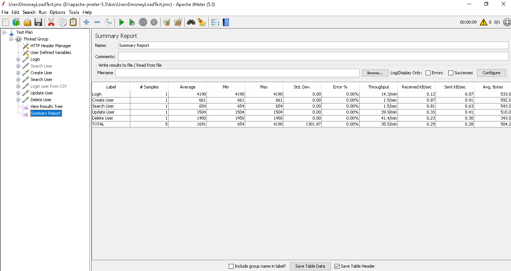

## User Module API Testing using Jmeter
- [API](http://dmoney.professionaltrainingbd.com/)

## **How to run this project is given below**:
## **Clone From**:

 clone path  https://github.com/IsfathAfrin/Dmoney_API_Load_Test.git

- Move jmx file into \apache-jmeter-5.3\bin path
- Open in windows terminal or git bash terminal and run below command

```
jmeter -n -t "UsersDmoneyLoadTest.jmx" -l "UsersDmoneyLoadTest.csv" -e -o Reports
```
## Steps
- Create user
- Search user
- Update user by id
- Delete user
   
## View Results & Summary Report is given below:
  
  
   

